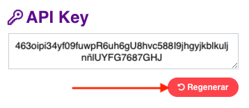

# Introducción

<aside class="notice">
Antes de comenzar a consumir la API de Pakke, es necesario tener una cuenta de usuario. Si aún no tienes la tuya, puedes obtenerla <a href="https://seller.pakke.mx">aquí</a>.
</aside>

La API de Pakke está diseña sobre REST, por lo tanto, encontrarás que las URL de los servicios están orientadas a recursos generales e individuales, además de usar códigos de respuesta HTTP estandarizados para indicar posibles errores en las peticiones.

El formato de todas las respuestas de la API, incluyendo errores, es JSON. Además, ten en cuenta que **todas las propiedades** de los parámetros de entrada **son case-sensitive**. 

Por el momento, la API REST de Pakke no tiene dispobnible un ambiente de pruebas, solo se puede accesar a ella en ambiente **productivo**.

## API Endpoints

Las URLs de los recursos de la API Pakke están formadas por la **URI base** más el nombre de la entidad y la operación. En otros casos, además, se requerirá especificar el identificador individual del objeto que se quiera consultar en un formato tipo **entidad/operacion/{OBJECT_ID}**.

La URI base que debe ser utilizada en todos los servicios expuestos de la API de Pakke es **https://seller.pakke.mx/api/v1/**. 

Por ejemplo, si queremos obtener los servicios de envío disponibles por courier, la URL que deberíamos utilizar sería el URI base más el recurso 'CourierServices':

<table style="width:100%;">
    <tbody style="border: 1px #D9D9D9 solid;">
        <tr>
            <th style="background: white; color: black;">https://seller.pakke.mx/api/v1/CourierServices</th>
        </tr>
    </tbody>
</table>

Por otro lado, si estamos tratando de obtener la información de una guía en particular, la URL que se debería utilizar sería la URI base más el recurso y el identificador individual de la guía:

<table style="width: auto">
    <tbody style="border: 1px #D9D9D9 solid;">
        <tr>
            <th style="background: white; color: black;">https://seller.pakke.mx/api/v1/Shipments/{SHIPMENT_ID}</th>
        </tr>
    </tbody>
</table>

Todas las peticiones requieren que se envíen las cabeceras HTTP adecuadas, **el token de autenticación** y el resto de los parámetros que cada recurso requiera en formato de objeto JSON.

## Autenticación
> Ejemplo de petición con autorización de llamadas de la API con la cabecera Authorization

```shell
curl -X POST
    -H 'Content-Type: application/json' \
    -H 'Accept: application/json' \
    -H 'Authorization: cHZHeERWFDFQWE434325FFF5DDG768D4B33MwTT4oFpQnyYwm00SxECK' \
    https://seller.pakke.mx/api/v1/CourierServices
```

A excepción de los recursos públicos, **todos** los endpoints de la API Pakke requieren de una llave de API (o token de autenticación) que identifique la cuenta de usuario que se usará para realizar las operaciones. El token de autenticación tiene que enviarse como parte de la petición HTTP como valor de la cabecera **'Authorization'**.

Existen 2 tipos de llaves de API o tokens de autenticación:

1. Token temporal
2. API Key.

Ambos difieren entre sí por el periodo de tiempo en el que el token es vigente: Los tokens temporales tienen un periodo de vigencia corto y las API Keys se pueden utilizar indefinidamente (al menos mientras no se solicite el cambio de la llave o se haga un reseteo de las mismas).

La decisión de usar uno u otro tipo de autenticación dependerá de las necesidades de cada integración.

### Autenticación temporal
> Ejemplo de petición:

```shell
curl -X POST \
    -H 'Content-Type: application/json' \
    -H 'Accept: application/json' \
    -d '{"email": "usuario@email.com", "password": "demo.1234" }' \
    https://seller.pakke.mx/api/v1/Users/login
```

```shell
Ejemplo de respuesta:

{
    "token": "cHZHeERWFDFQWE434325FFF5DDG768D4B33MwTT4oFpQnyYwm00SxECK",
    "userId": "338fere-n32wdqk4k3l-4we7-a6e49-nkte2naak4",
    "ttl": 1209600,
    "created": "2018-12-07T19:31:53.554Z",
    "roles": ["END_USER"]
}
```

Para obtener un token temporal se necesita utilizar el endpoint **/Users/login**. Este servicio requiere que se envíen por POST las mismas credenciales de acceso que se utilizan para iniciar sesión en Pakke. El token generado como respuesta solo será válido por un tiempo limitado y una vez caducado ya no podrá utilizarse. Si después de eso necesitas volver a utilizar algún otro endpoint será necesario que vuelvas a generar otro token temporal válid utilizando el mismo procedimiento.

Para determinar la vigencia del token temporal puedes utilizar la información de los campos de respuesta 'ttl' y 'created'.

#### Endpoint

<table style="width: auto">
    <tbody style="border: 1px #D9D9D9 solid;">
        <tr>
            <th style="background: #ff4d55; color: white;">POST</th>
            <th style="background: white; color: black;">/Users/login</th>
        </tr>
        <tr>
            <td colspan="2">No requiere autenticación</th>
        </tr>
    </tbody>
</table>

#### Parámetros

<table style="width: auto">
    <tbody style="border: 1px #D9D9D9 solid;">
        <tr>
            <th style="background: #e8e8e8; color: black;">Campo</th>
            <th style="background: #e8e8e8; color: black;">Tipo</th>
            <th style="background: #e8e8e8; color: black;">Requerido</th>
            <th style="background: #e8e8e8; color: black;">Descripción</th>
        </tr>
        <tr>
            <td>Email</td>
            <td>String</td>
            <td>Si</td>
            <td>Correo electrónico de la cuenta de usuario</td>
        </tr>
        <tr>
            <td>Password</td>
            <td>String</td>
            <td>Si</td>
            <td>Contraseña de acceso de la cuenta de usuario</td>
        </tr>
    </tbody>
</table>

#### Respuesta

<table style="width: auto">
    <tbody style="border: 1px #D9D9D9 solid;">
        <tr>
            <th style="background: #e8e8e8; color: black;">Propiedad</th>
            <th style="background: #e8e8e8; color: black;">Tipo</th>
            <th style="background: #e8e8e8; color: black;">Descripción</th>
        </tr>
        <tr>
            <td>userId</td>
            <td>String</td>
            <td>Identificador de la cuenta de usuario</td>
        </tr>
        <tr>
            <td>token</td>
            <td>String</td>
            <td>Token temporal</td>
        </tr>
        <tr>
            <td>ttl</td>
            <td>Number</td>
            <td>Número de segundos de vigencia del token temporal</td>
        </tr>
        <tr>
            <td>created</td>
            <td>String</td>
            <td>Fecha (en formato UTC) en la que se generó el token temporal </td>
        </tr>
        <tr>
            <td>roles</td>
            <td>Array</td>
            <td>Listado de roles aplicables a la cuenta de usuario</td>
        </tr>
    </tbody>
</table>

### Autenticación por API Key

Para generar un API Key sin vigencia definida solo hay que iniciar sesión en Pakke, entrar a la página **'Mi Perfil'** ir a la sección **'API Key'** y después dar clic en el botón **'Regenerar'**:



Este proceso lo puedes hacer las veces que sea necesario, cuando quieras cambiar tu API Key. Por favor toma en cuenta que al regenerar tu llave de API también tendrás que cambiarla en tu integración.

## Errores
> Ejemplo de petición errónea (sin token de autenticación) al servicio de servicios de courier

```shell
curl -X POST
    -H 'Content-Type: application/json' \
    -H 'Accept: application/json' \
    https://seller.pakke.mx/api/v1/CourierServices
```
> Respuesta de error

```shell
{
    "error": {
        "statusCode": 401,
        "name": "Error",
        "message": "Authorization Required",
        "code": "AUTHORIZATION_REQUIRED"
    }
}
```

En caso de que haya algún problema con las peticiones hechas al API de Pakke, ésta devolverá objetos de JSON cuando exista un error.

#### Respuesta de error

<table style="width: auto">
    <tbody style="border: 1px #D9D9D9 solid;">
        <tr>
            <th style="background: #e8e8e8; color: black;">Campo</th>
            <th style="background: #e8e8e8; color: black;">Tipo</th>
            <th style="background: #e8e8e8; color: black;">Descripción</th>
        </tr>
        <tr>
            <td>statusCode</td>
            <td>String</td>
            <td>Código​ ​HTTP​ ​de​ ​la​ ​causa​ ​del​ ​error</td>
        </tr>
        <tr>
            <td>message</td>
            <td>String</td>
            <td>Tipificación​ ​de​ ​la​ ​excepción​ ​(uso​ ​interno)</td>
        </tr>
        <tr>
            <td>Code</td>
            <td>String</td>
            <td>Código interno de la ​excepción​ </td>
        </tr>
        <tr>
            <td>details</td>
            <td>String</td>
            <td>Mensajes ​de​ error con ​la​s ​excepciones</td>
        </tr>
     </tbody>
</table>

# Couriers y Servicios

Dentro de este apartado se incluyen los endpoints para consultar los
couriers/carriers disponibles en Pakke, sus servicios y los
equivalentes en la nomenclatura del API.

## Couriers
> Ejemplo de petición

```shell
curl -X GET \
    -H 'Content-Type: application/json' \
    -H 'Accept: application/json' \
    -H 'Authorization: cHZHeERWFDFQWE434325FFF5DDG768D4B33MwTT4oFpQnyYwm00SxECK' \
    https://seller.pakke.mx/api/v1/Couriers
```
> Respuesta

```shell
{
[
    {
        "CourierCode": "99M",
        "Name": "99M",
        "Status": 1,
        "VolumetricWeightFactor": 5000,
        "HasPickupActive": false
    },
    {
        "CourierCode": "STF",
        "Name": "Estafeta",
        "Status": 1,
        "VolumetricWeightFactor": 5000,
        "HasPickupActive": true
    }
]
}
```
Para obtener el listado de couriers activos en la plataforma, se debe utilizar el siguiente endpoint:

#### Endpoint

<table style="width: auto">
    <tbody style="border: 1px #D9D9D9 solid;">
        <tr>
            <th style="background: #ff4d55; color: white;">GET</th>
            <th style="background: white; color: black;">/Couriers</th>
        </tr>
    </tbody>
</table>

#### Respuesta

Un Array de objetos con información del courier

<table style="width: auto">
    <tbody style="border: 1px #D9D9D9 solid;">
        <tr>
            <th style="background: #e8e8e8; color: black;">Propiedad</th>
            <th style="background: #e8e8e8; color: black;">Tipo</th>
            <th style="background: #e8e8e8; color: black;">Descripción</th>
        </tr>
        <tr>
            <td>CourierCode</td>
            <td>String</td>
            <td>Identificador corto del courier</td>
        </tr>
        <tr>
            <td>Name</td>
            <td>String</td>
            <td>Nombre completo del courier</td>
        </tr>
        <tr>
            <td>Status</td>
            <td>Number</td>
            <td>Bandera para indicar si el courier está o no activo</td>
        </tr>
        <tr>
            <td>VolumetricWeightFactor</td>
            <td>Number</td>
            <td>Factor para calcular el peso volumétrico de los paquetes</td>
        </tr>
        <tr>
            <td>HasPickupActive</td>
            <td>Boolean</td>
            <td>Bandera para indicar si el courier permite o no recolecciones</td>
        </tr>
    </tbody>
</table>

## Servicios

> Ejemplo de petición

```shell
curl -X GET
    -H 'Content-Type: application/json' \
    -H 'Accept: application/json' \
    -H 'Authorization: cHZHeERWFDFQWE434325FFF5DDG768D4B33MwTT4oFpQnyYwm00SxECK' \
    https://seller.pakke.mx/api/v1/CourierServices
```

> Respuesta ​-​ ​HTTP Success​ ​200

```shell
[
    {
        "CourierServiceId": "bicycle",
        "CourierCode": "99M",
        "Description": "Mismo dia bicycle",
        "DeliveryDays": "1 día hab."
    },
    {
        "CourierServiceId": "bicycle99",
        "CourierCode": "99M",
        "Description": "Express bicycle",
        "DeliveryDays": "1 día hab."
    },
    {
        "CourierServiceId": "ESTAFETA_DIA_SIGUIENTE",
        "CourierCode": "STF",
        "Description": "Dia Siguiente",
        "DeliveryDays": "1 día hab."
    },
    {
        "CourierServiceId": "ESTAFETA_TERRESTRE_CONSUMO",
        "CourierCode": "STF",
        "Description": "Terrestre Consumo",
        "DeliveryDays": "2 - 5 dias hab."
    }
]
```

Para obtener el listado de los servicios homologados en la plataforma, se debe utilizar el siguiente endpoint:

#### Endpoint

<table style="width: auto">
    <tbody style="border: 1px #D9D9D9 solid;">
        <tr>
            <th style="background: #ff4d55; color: white;">GET</th>
            <th style="background: white; color: black;">/CourierServices</th>
        </tr>
    </tbody>
</table>

#### Respuesta

Un Array de objetos con información del courier

<table style="width: auto">
    <tbody style="border: 1px #D9D9D9 solid;">
        <tr>
            <th style="background: #e8e8e8; color: black;">Propiedad</th>
            <th style="background: #e8e8e8; color: black;">Tipo</th>
            <th style="background: #e8e8e8; color: black;">Descripción</th>
        </tr>
        <tr>
            <td>CourierServiceId</td>
            <td>String</td>
            <td>Identificador de servicio de courier</td>
        </tr>
        <tr>
            <td>CourierCode</td>
            <td>String</td>
            <td>Identificador corto del courier</td>
        </tr>
        <tr>
            <td>Description</td>
            <td>String</td>
            <td>Descripción larga del servicio de courier</td>
        </tr>
        <tr>
            <td>DeliveryDays</td>
            <td>String</td>
            <td>Descripción de la fecha de entrega esperada</td>
        </tr>
    </tbody>
</table>

# Envíos

Dentro de esta sección se listan los endpoints para crear y consultar envíos, obtener su detalle y hacer búsquedas.

## Cotización de guías

> Ejemplo de petición

```shell
curl -X POST \
    -H 'Content-Type: application/json' \
    -H 'Accept: application/json' \
    -H 'Authorization: cHZHeERWFDFQWE434325FFF5DDG768D4B33MwTT4oFpQnyYwm00SxECK' \
    -d '{
        "ZipCodeFrom": "64000",
        "ZipCodeTo": "06000",
        "Parcel": {
            "Weight": 1,
            "Width": 10,
            "Height": 10,
            "Length": 10
        },
        "CouponCode": null,
        "InsuredAmount": 1000
    }' \
    https://seller.pakke.mx/api/v1/Shipments
```
> Respuesta

```shell
{
    "Pakke": [
        {
            "CourierCode": "STF",
            "CourierName": "Estafeta",
            "CourierServiceId": "ESTAFETA_TERRESTRE_CONSUMO",
            "CourierServiceName": "Terrestre Consumo",
            "DeliveryDays": "2-5 días hab.",
            "CouponCode": null,
            "DiscountAmount": 0,
            "TotalPrice": 85.83,
            "EstimatedDeliveryDate": "2019-07-04",
            "BestOption": true
        },
        {
            "CourierCode": "STF",
            "CourierName": "Estafeta",
            "CourierServiceId": "ESTAFETA_DIA_SIGUIENTE",
            "CourierServiceName": "Dia Siguiente",
            "DeliveryDays": "1 día hab.",
            "CouponCode": null,
            "DiscountAmount": 0,
            "TotalPrice": 117.67,
            "EstimatedDeliveryDate": "2019-07-04",
            "BestOption": false
        },
        {
            "CourierCode": "FDX",
            "CourierName": "FedEx",
            "CourierServiceId": "FEDEX_EXPRESS_SAVER",
            "CourierServiceName": "Express Saver",
            "DeliveryDays": "3 días hab.",
            "CouponCode": null,
            "DiscountAmount": 0,
            "TotalPrice": 134.75,
            "EstimatedDeliveryDate": "2019-07-04",
            "BestOption": false
        },
        {
            "CourierCode": "FDX",
            "CourierName": "FedEx",
            "CourierServiceId": "FEDEX_STANDARD_OVERNIGHT",
            "CourierServiceName": "Standard Overnight",
            "DeliveryDays": "1 día hab.",
            "CouponCode": null,
            "DiscountAmount": 0,
            "TotalPrice": 184.51,
            "EstimatedDeliveryDate": "2019-07-04",
            "BestOption": false
        }
    ]
}
```
Con este endpoint podrás obtener la cotización del envío de los couriers/carriers disponibles en la plataforma:

#### Endpoint
<table style="width: auto">
    <tbody style="border: 1px #D9D9D9 solid;">
        <tr>
            <th style="background: #ff4d55; color: white;">POST</th>
            <th style="background: white; color: black;">/Shipments/rates</th>
        </tr>
    </tbody>
</table>

#### Parámetros
<table style="width: auto">
    <tbody style="border: 1px #D9D9D9 solid;">
        <tr>
            <th style="background: #e8e8e8; color: black;">Campo</th>
            <th style="background: #e8e8e8; color: black;">Tipo</th>
            <th style="background: #e8e8e8; color: black;">Requerido</th>
            <th style="background: #e8e8e8; color: black;">Descripción</th>
        </tr>
        <tr>
            <td>ZipCodeFrom</td>
            <td>String</td>
            <td>Si</td>
            <td>Código postal origen del paquete</td>
        </tr>
        <tr>
            <td>ZipCodeTo</td>
            <td>String</td>
            <td>Si</td>
            <td>Código postal destino del paquete</td>
        </tr>
        <tr>
            <td>Parcel</td>
            <td>ShipmentParcel</td>
            <td>Si</td>
            <td>Información​ ​del dimensiones ​y peso del paquete</td>
        </tr>
        <tr>
            <td>CouponCode</td>
            <td>String</td>
            <td>No</td>
            <td>Código de cupón que se aplicaría a la generación de la guía</td>
        </tr>
         <tr>
            <td>InsuredAmount</td>
            <td>Number</td>
            <td>No</td>
            <td>Valor declarado del paquete que servirá para determinar el costo del seguro de entrega</td>
        </tr>
    </tbody>
</table>

#### Respuesta
<table style="width: auto">
    <tbody style="border: 1px #D9D9D9 solid;">
        <tr>
            <th style="background: #e8e8e8; color: black;">Campo</th>
            <th style="background: #e8e8e8; color: black;">Tipo</th>
            <th style="background: #e8e8e8; color: black;">Descripción</th>
        </tr>
        <tr>
            <td>Pakke</td>
            <td>Array<ServiceItems></td>
            <td>Lista​ ​de​ ​servicios​ ​ofrecidos​ ​por​ ​Pakke</td>
        </tr>
    </tbody>
</table>

### ShipmentParcel

<table style="width: auto">
    <tbody style="border: 1px #D9D9D9 solid;">
        <tr>
            <th style="background: #e8e8e8; color: black;">Campo </th>
            <th style="background: #e8e8e8; color: black;">Tipo</th>
            <th style="background: #e8e8e8; color: black;">Descripción</th>
        </tr>
        <tr>
            <td>CourierCode</td>
            <td>String</td>
            <td>Identificador corto del courier</td>
        </tr>
        <tr>
            <td>CourierName</td>
            <td>String</td>
            <td>Nombre del courier</td>
        </tr>
        <tr>
            <td>CourierServiceId</td>
            <td>String</td>
            <td>Identificador ​de​ ​servicio​ del courier</td>
        </tr>
        <tr>
            <td>CourierServiceName</td>
            <td>String</td>
            <td>Nombre del ​servicio​</td>
        </tr>
        <tr>
            <td>DeliveryDays</td>
            <td>String</td>
            <td>Descripción de los días de entrega</td>
        </tr>
        <tr>
            <td>CouponCode</td>
            <td>String</td>
            <td>Código del cupón aplicado al costo</td>
        </tr>
        <tr>
            <td>DiscountAmount</td>
            <td>Number</td>
            <td>Total del descuento aplicado al costo</td>
        </tr>
        <tr>
            <td>TotalPrice</td>
            <td>Number</td>
            <td>Total del costo (ya con descuento aplicado)</td>
        </tr>
        <tr>
            <td>BestOption</td>
            <td>Boolean</td>
            <td>Bandera que indica si el costo es el mejor (el menos costoso)</td>
        </tr>
    </tbody>
</table>

### ShipmentParcel
Este objeto se utiliza para especificar las dimensiones y peso del paquete.

<table style="width: auto">
    <tbody style="border: 1px #D9D9D9 solid;">
        <tr>
            <th style="background: #e8e8e8; color: black;">Campo</th>
            <th style="background: #e8e8e8; color: black;">Tipo</th>
            <th style="background: #e8e8e8; color: black;">Requerido</th>
            <th style="background: #e8e8e8; color: black;">Descripción</th>
        </tr>
        <tr>
            <td>Length</td>
            <td>Number</td>
            <td>Si</td>
            <td>Longitud del paquete expresada en cms.</td>
        </tr>
        <tr>
            <td>Width</td>
            <td>Number</td>
            <td>Si</td>
            <td>Ancho del paquete expresado en cms.</td>
        </tr>
         <tr>
            <td>Height</td>
            <td>Number</td>
            <td>Si</td>
            <td>Alto del paquete expresado en cms.</td>
        </tr>
        <tr>
            <td>Weight</td>
            <td>Number</td>
            <td>Si</td>
            <td>Peso simple del paquete expresado en cms.</td>
        </tr>
    </tbody>
</table>

## Creación de guías

> Ejemplo de petición

```shell
curl -X POST \
    -H 'Content-Type: application/json' \
    -H 'Accept: application/json' \
    -H 'Authorization: cHZHeERWFDFQWE434325FFF5DDG768D4B33MwTT4oFpQnyYwm00SxECK' \
    -d '{
            "CourierCode": "FDX",
            "CourierServiceId": "ECO",
            "ResellerReference": "TCPIP-0817-23",
            "Content": "Producto",
            "AddressFrom": {
                "ZipCode": "87120",
                "State": "MX-TAM",
                "City": "Victoria",
                "Neighborhood": "Hacienda del Santuario",
                "Address1": "3301 Gamboa Ferrocarril",
                "Address2": "Apt. 149",
                "Residential": false
        },
            "AddressTo": {
                "ZipCode": "34040",
                "State": "MX-DUR",
                "City": "Durango",
                "Neighborhood": "Villa de Guadalupe",
                "Address1": "48787 Alejandro Arrabal",
                "Address2": "Apt. 845",
                "Residential": true
        },
            "Parcel": {
                "Length": 73,
                "Width": 77,
                "Height": 33,
                "Weight": 2
        },
            "Sender": {
                "Name": "Hugo Domínguez",
                "Phone1": "5627-452-122",
                "Phone2": "5621-911-389",
                "Email": "Matas_Roybal@corpfolder.com"
        },
            "Recipient": {
                "Name": "Benjamín Grijalva",
                "CompanyName": "Espinoza - Colunga",
                "Phone1": "5124-468-864",
                "Email": "Antonio.Sanabria54@nearbpo.com"
        }
    }' \
    https://seller.pakke.mx/api/v1/Shipments
```
> Respuesta

```shell
{
    "ShipmentId": "efa1fab0-9934-11e9-829b-51a5cf8a966e",
    "ResellerId": "f9de4742-29fc-4c18-a66e-f56b8e82cd09",
    "OwnerId": "c8d1f584-ae79-4fb5-b8a4-d68bfca3c2e3",
    "OrderId": null,
    "CreatedAt": "2019-06-27T18:40:26.069-05:00",
    "ExpiresAt": "2019-07-02T18:40:26.069-05:00",
    "CourierName": "FedEx",
    "CourierCode": "FDX",
    "CourierServiceId": "FEDEX_STANDARD_OVERNIGHT",
    "CourierService": "Standard Overnight",
    "ResellerReference": "",
    "HasExceptions": false,
    "HasChangeZipCode": false,
    "SendRecipientNotifications": false,
    "InsuredAmount": 0,
    "Parcel": {
        "Length": 73,
        "Width": 77,
        "Height": 33,
        "Weight": 2
    },
    "QuotedWeight": 5,
    "RealWeight": 5,
    "RealOverWeight": 0,
    "CoveredWeight": 5,
    "OverWeight": 0,
    "OverWeightPrice": 15,
    "CoveredAmount": 225.43,
    "ExtrasAmount": 0,
    "QuotedAmount": 225.43,
    "DiscountAmount": 0,
    "CouponCode": null,
    "InsuranceAmount": 0,
    "InsurancePercentFactor": 1.2,
    "TotalAmount": 225.43,
    "OriginalWeight": 5,
    "OriginalWidth": 30,
    "OriginalLength": 40,
    "OriginalHeight": 20,
    "OriginalVolumetricWeight": 5,
    "AddressFrom": {
        "ZipCode": "87120",
        "State": "MX-TAM",
        "City": "Victoria",
        "Neighborhood": "Hacienda del Santuario",
        "Address1": "3301 Gamboa Ferrocarril",
        "Address2": "Apt. 149",
        "Residential": false
    },
    "AddressTo": {
        "ZipCode": "34040",
        "State": "MX-DUR",
        "City": "Durango",
        "Neighborhood": "Villa de Guadalupe",
        "Address1": "48787 Alejandro Arrabal",
        "Address2": "Apt. 845",
        "Residential": true
    },
    "Sender": {
        "Name": "Hugo Domínguez",
        "Phone1": "5627-452-122",
        "Phone2": "5621-911-389",
        "Email": "Matas_Roybal@corpfolder.com"
    },
    "Recipient": {
        "Name": "Benjamín Grijalva",
        "CompanyName": "Espinoza - Colunga",
        "Phone1": "5124-468-864",
        "Email": "Antonio.Sanabria54@nearbpo.com"
    },
    "Owner": "pospago@pakke.mx",
    "DaysInTransit": null,
    "EnableRefund": 1,
    "ChangeZipCode": null,
    "Content": "Accesorios",
    "transactions": [],
    "Credentials": null,
    "TrackingNumberReplaced": null,
    "Folio": null,
    "EstimatedDeliveryDate": "2019-06-28",
    "TrackingNumber": "794622745362",
    "WaybillNumber": null,
    "Label": "JVBERi0xLjQKMSA[...]FydHhyZWYKNzIyMQolJUVPRgo=",
    "Status": "SUCCESS",
    "TrackingStatus": "WAITING"
}
```
Este endpoint realiza el trabajo de validar los datos de entrada y enviar
dichos datos al courier seleccionado para generar la etiqueta de la guía:

#### Endpoint
<table style="width: auto">
    <tbody style="border: 1px #D9D9D9 solid;">
        <tr>
            <th style="background: #ff4d55; color: white;">POST</th>
            <th style="background: white; color: black;">/Shipments</th>
        </tr>
    </tbody>
</table>

#### Parámetros
<table style="width: auto">
    <tbody style="border: 1px #D9D9D9 solid;">
        <tr>
            <th style="background: #e8e8e8; color: black;">Campo</th>
            <th style="background: #e8e8e8; color: black;">Tipo</th>
            <th style="background: #e8e8e8; color: black;">Requerido</th>
            <th style="background: #e8e8e8; color: black;">Descripción</th>
        </tr>
        <tr>
            <td>CourierCode</td>
            <td>String</td>
            <td>No</td>
            <td>Identificador corto de courier</td>
        </tr>
        <tr>
            <td>CourierServiceId</td>
            <td>String</td>
            <td>No</td>
            <td>Identificador de servicio de courier</td>
        </tr>
         <tr>
            <td>ResellerReference</td>
            <td>String</td>
            <td>No</td>
            <td>Referencia​ ​personalizada del paquete</td>
        </tr>
        <tr>
            <td>Parcel</td>
            <td>ShipmentParcel</td>
            <td>Si</td>
            <td>Información​ ​del dimensiones ​y peso del paquete</td>
        </tr>
        <tr>
            <td>AddressFrom</td>
            <td>ShipmentAddress</td>
            <td>Si</td>
            <td>Dirección​ ​de​ ​Envío</td>
        </tr>
         <tr>
            <td>AddressTo</td>
            <td>ShipmentAddress</td>
            <td>Si</td>
            <td>Dirección​ ​de​ ​Entrega</td>
        </tr>
        <tr>
            <td>Sender</td>
            <td>ShipmentContact</td>
            <td>Si</td>
            <td>Información del remitente</td>
        </tr>
         <tr>
            <td>Recipient</td>
            <td>ShipmentContact</td>
            <td>Si</td>
            <td>Información del destinatario</td>
        </tr>
    </tbody>
</table>

<aside class="notice">
Nota: Si CourierCode y CourierServiceId no son especificados, la API
seleccionará la mejor opción disponible para el envío (la menos costosa).
</aside>


#### Respuesta
<table style="width: auto">
    <tbody style="border: 1px #D9D9D9 solid;">
        <tr>
            <th style="background: #e8e8e8; color: black;">Campo</th>
            <th style="background: #e8e8e8; color: black;">Tipo</th>
            <th style="background: #e8e8e8; color: black;">Descripción</th>
        </tr>
        <tr>
            <td>ShipmentId</td>
            <td>String</td>
            <td>Identificador​ ​único​ ​del​ ​envío</td>
        </tr>
         <tr>
            <td>ResellerId</td>
            <td>String</td>
            <td>Identificador​ ​de la cuenta de reseller que creó la guía</td>
        </tr>
        <tr>
            <td>OwnerId</td>
            <td>String</td>
            <td>Identificador​ ​del​ ​reseller</td>
        </tr>
        <tr>
            <td>CreatedAt</td>
            <td>date</td>
            <td>Fecha/hora​ ​de​ ​la​ ​creación​ ​del​ ​envío</td>
        </tr>
        <tr>
            <td>ExpiresAt</td>
            <td>date</td>
            <td>Fecha/hora​ ​de​ expiración de la etiqueta de envío</td>
        </tr>
        <tr>
            <td>CourierName</td>
            <td>String</td>
            <td>Nombre del courier</td>
        </tr>
        <tr>
            <td>CourierCode</td>
            <td>String</td>
            <td>Identificador corto del courier</td>
        </tr>
        <tr>
            <td>CourierServiceId</td>
            <td>String</td>
            <td>Identificador ​de​ ​servicio​ del courier</td>
        </tr>
        <tr>
            <td>CourierService</td>
            <td>String</td>
            <td>Nombre del ​servicio​</td>
        </tr>
        <tr>
            <td>ResellerReference</td>
            <td>String</td>
            <td>Referencia​ ​personalizada del paquete</td>
        </tr>
        <tr>
            <td>HasExceptions</td>
            <td>Boolean</td>
            <td>Bandera que indica si el envío tiene excepciones de entrega</td>
        </tr>
        <tr>
            <td>HasChangeZipCode</td>
            <td>Boolean</td>
            <td>Bandera que indica si se detectó si el envío cambió de códigos postales de entrega</td>
        </tr>
        <tr>
            <td>SendRecipientNotifications</td>
            <td>Boolean</td>
            <td>Bandera que indica si la guía tiene activado el envío de notificaciones</td>
        </tr>
        <tr>
            <td>InsuredAmount</td>
            <td>Number</td>
            <td>Monto del seguro de envío</td>
        </tr>
         <tr>
            <td>Parcel</td>
            <td>ShipmentParcel</td>
            <td>Información​ ​del​ ​Paquete</td>
        </tr>
        <tr>
            <td>AddressFrom</td>
            <td>ShipmentAddress</td>
            <td>Dirección​ ​de​ ​Envío</td>
        </tr>
        <tr>
            <td>AddressTo</td>
            <td>ShipmentAddress</td>
            <td>Dirección​ ​de​ ​Entrega</td>
        </tr>
        <tr>
            <td>Sender</td>
            <td>ShipmentContact</td>
            <td>Información del remitente</td>
        </tr>
        <tr>
            <td>Recipient</td>
            <td>ShipmentContact</td>
            <td>Información del destinatario</td>
        </tr>
        <tr>
            <td>QuotedAmount</td>
            <td>Number</td>
            <td>Precio cotizado</td>
        </tr>
        <tr>
            <td>DiscountAmount</td>
            <td>Number</td>
            <td>Descuento</td>
        </tr>
        <tr>
            <td>InsuranceAmount</td>
            <td>Number</td>
            <td>Costo del seguro</td>
        </tr>
        <tr>
            <td>TotalAmount</td>
            <td>Number</td>
            <td>Costo total del paquete</td>
        </tr>
        <tr>
            <td>OverWeightPrice</td>
            <td>Number</td>
            <td>Precio por kilo de sobrepeso</td>
        </tr>
        <tr>
            <td>OriginalWeight</td>
            <td>Number</td>
            <td>Peso simple del paquete cotizado</td>
        </tr>
        <tr>
            <td>OriginalWidth</td>
            <td>Number</td>
            <td>Ancho del paquete cotizado</td>
        </tr>
        <tr>
            <td>OriginalLength</td>
            <td>Number</td>
            <td>Longitud del paquete cotizado</td>
        </tr>
        <tr>
            <td>OriginalHeight</td>
            <td>Number</td>
            <td>Altura del paquete cotizado</td>
        </tr>
        <tr>
            <td>OriginalVolumetricWeight</td>
            <td>Number</td>
            <td>Peso volumétrico del paquete cotizado</td>
        </tr>
        <tr>
            <td>RealWeight</td>
            <td>Number</td>
            <td>Peso real del paquete</td>
        </tr>
        <tr>
            <td>RealOverWeight</td>
            <td>Number</td>
            <td>Sobrepeso real del paquete</td>
        </tr>
        <tr>
            <td>Owner</td>
            <td>String</td>
            <td>Correo electrónico del reseller</td>
        </tr>
        <tr>
            <td>DaysInTransit</td>
            <td>Number</td>
            <td>Días en tránsito del paquete</td>
        </tr>
        <tr>
            <td>Content</td>
            <td>String</td>
            <td>Contenido del paquete</td>
        </tr>
        <tr>
            <td>transactions</td>
            <td>Array</td>
            <td>Array con las transacciones generadas por la guía</td>
        </tr>
        <tr>
            <td>Status</td>
            <td>String</td>
            <td>Estatus de la guía:
                <ul>
                    <li>SUCCESS​ - Envío generado</li>
                    <li>REFUNDED ​-​ ​Envío reembolsado</li>
                    <li>REFUNDPENDING -​ Envío con reembolso pendiente</li>
                    <li>REFUNDFAILED - Envío con reembolso fallido</li>
                </ul>
            </td>
        </tr>
        <tr>
            <td>TrackingNumber</td>
            <td>String</td>
            <td>Número​ ​de​ ​guía​ ​del​ ​courier</td>
        </tr>
        <tr>
            <td>TrackingStatus</td>
            <td>String</td>
            <td>Estatus del rastreo:
                <ul>
                    <li>WAITING ​-​ ​Guía generada y esperando recolección</li>
                    <li>IN_TRANSIT ​-​ ​Paquete en tránsito</li>
                    <li>ON_DELIVERY​-​ Paquete en proceso de entrega</li>
                    <li>DELIVERED​ - Paquete entregado</li>
                    <li>RETURNED - Paquete devuelto</li>
                    <li>CANCELLED - ​​Guía cancelada o expirada</li>
                    <li>EXCEPTION - Paquete con ​errores de entrega</li>
                </ul>
            </td>
        </tr>
        <tr>
            <td>Label</td>
            <td>String</td>
            <td>Etiqueta de la guía de envío PDF​ ​en​ formato ​base64</td>
        </tr>
    </tbody>
</table>

### ShipmentParcel
Este objeto se utiliza para especificar las dimensiones y peso del paquete.

<table style="width: auto">
    <tbody style="border: 1px #D9D9D9 solid;">
        <tr>
            <th style="background: #e8e8e8; color: black;">Campo</th>
            <th style="background: #e8e8e8; color: black;">Tipo</th>
            <th style="background: #e8e8e8; color: black;">Requerido</th>
            <th style="background: #e8e8e8; color: black;">Descripción</th>
        </tr>
        <tr>
            <td>Length</td>
            <td>Number</td>
            <td>Si</td>
            <td>Longitud del paquete expresada en cms.</td>
        </tr>
        <tr>
            <td>Width</td>
            <td>Number</td>
            <td>Si</td>
            <td>Ancho del paquete expresado en cms.</td>
        </tr>
         <tr>
            <td>Height</td>
            <td>Number</td>
            <td>Si</td>
            <td>Alto del paquete expresado en cms.</td>
        </tr>
        <tr>
            <td>Weight</td>
            <td>Number</td>
            <td>Si</td>
            <td>Peso simple del paquete expresado en cms.</td>
        </tr>
    </tbody>
</table>

### ShipmentAddress
Este objeto representa una la dirección de envío o de entrega.

<table style="width: auto">
    <tbody style="border: 1px #D9D9D9 solid;">
        <tr>
            <th style="background: #e8e8e8; color: black;">Campo</th>
            <th style="background: #e8e8e8; color: black;">Tipo</th>
            <th style="background: #e8e8e8; color: black;">Requerido</th>
            <th style="background: #e8e8e8; color: black;">Descripción</th>
        </tr>
        <tr>
            <td>ZipCode</td>
            <td>String</td>
            <td>Si</td>
            <td>Código​ ​postal</td>
        </tr>
        <tr>
            <td>State</td>
            <td>String</td>
            <td>Si</td>
            <td>Entidad​ ​Federativa​ ​(texto​ ​libre)</td>
        </tr>
         <tr>
            <td>City</td>
            <td>String</td>
            <td>Si</td>
            <td>Municipio/Ciudad</td>
        </tr>
        <tr>
            <td>Neighborhood</td>
            <td>String</td>
            <td>Si</td>
            <td>Colonia</td>
        </tr>
          <tr>
            <td>Address1</td>
            <td>String</td>
            <td>Si</td>
            <td>Calle y número</td>
        </tr>
        <tr>
            <td>Address2</td>
            <td>String</td>
            <td>Si</td>
            <td>Datos adicionales</td>
        </tr>
        <tr>
            <td>Residential</td>
            <td>Boolean</td>
            <td>No</td>
            <td>Indica​ ​si​ ​la​ ​dirección​ ​necesita​ ​un​ ​trato especial​ ​por​ ​el​ ​courier​ ​(solo​ ​tiene​ ​efecto en​ ​la​ ​entrega)</td>
        </tr>
    </tbody>
</table>

###ShipmentContact
Este objeto se usa para pare los datos de contacto del remitente o destinatario.

<table style="width: auto">
    <tbody style="border: 1px #D9D9D9 solid;">
        <tr>
            <th style="background: #e8e8e8; color: black;">Campo</th>
            <th style="background: #e8e8e8; color: black;">Tipo</th>
            <th style="background: #e8e8e8; color: black;">Requerido</th>
            <th style="background: #e8e8e8; color: black;">Descripción</th>
        </tr>
        <tr>
            <td>Name</td>
            <td>String</td>
            <td>Si</td>
            <td>Nombre​ ​del​ ​contacto</td>
        </tr>
        <tr>
            <td>Email</td>
            <td>String</td>
            <td>No</td>
            <td>Correo​ ​electrónico</td>
        </tr>
         <tr>
            <td>Phone1</td>
            <td>String</td>
            <td>No</td>
            <td>Teléfono​ ​de contacto 1</td>
        </tr>
        <tr>
            <td>Phone2</td>
            <td>String</td>
            <td>No</td>
            <td>Teléfono​ ​de contacto 2</td>
        </tr>
        <tr>
            <td>CompanyName</td>
            <td>String</td>
            <td>Si, solo​  para ​el​ ​destinatario</td>
            <td>Nombre de la empresa</td>
        </tr>
    </tbody>
</table>

## Consulta​ ​de​ guías

> Ejemplo de petición

```shell
curl -X GET \
    -H 'Content-Type: application/json' \
    -H 'Accept: application/json' \
    -H 'Authorization: cHZHeERWFDFQWE434325FFF5DDG768D4B33MwTT4oFpQnyYwm00SxECK' \
    https://seller.pakke.mx/api/v1/Shipments/{SHIPMENT_ID}/
```

> Respuesta​ ​-​ ​Success​ ​200

```shell
{
    {
    "ShipmentId": "efa1fab0-9934-11e9-829b-51a5cf8a966e",
    "ResellerId": "f9de4742-29fc-4c18-a66e-f56b8e82cd09",
    "OwnerId": "c8d1f584-ae79-4fb5-b8a4-d68bfca3c2e3",
    "OrderId": null,
    "CreatedAt": "2019-06-27T18:40:26.069-05:00",
    "ExpiresAt": "2019-07-02T18:40:26.069-05:00",
    "TransitAt": "2019-07-02T18:40:26.069-05:00",
    "DeliveredAt": "2019-07-02T18:40:26.069-05:00",
    "CourierName": "FedEx",
    "CourierCode": "FDX",
    "CourierServiceId": "FEDEX_STANDARD_OVERNIGHT",
    "CourierService": "Standard Overnight",
    "ResellerReference": "",
    "HasExceptions": false,
    "HasLost": false,
    "HasChangeZipCode": false,
    "SendRecipientNotifications": false,
    "InsuredAmount": 0,
    "Parcel": {
        "Length": 73,
        "Width": 77,
        "Height": 33,
        "Weight": 2
    },
    "QuotedWeight": 5,
    "RealWeight": 5,
    "RealOverWeight": 0,
    "CoveredWeight": 5,
    "OverWeight": 0,
    "OverWeightPrice": 15,
    "CoveredAmount": 225.43,
    "ExtrasAmount": 0,
    "QuotedAmount": 225.43,
    "DiscountAmount": 0,
    "CouponCode": null,
    "InsuranceAmount": 0,
    "InsurancePercentFactor": 1.2,
    "TotalAmount": 225.43,
    "OriginalWeight": 5,
    "OriginalWidth": 30,
    "OriginalLength": 40,
    "OriginalHeight": 20,
    "OriginalVolumetricWeight": 5,
    "CourierWeight": 5,
    "CourierWidth": 30,
    "CourierLength": 40,
    "CourierHeight": 20,
    "CourierVolumetricWeight": 5,
    "AddressFrom": {
        "ZipCode": "87120",
        "State": "MX-TAM",
        "City": "Victoria",
        "Neighborhood": "Hacienda del Santuario",
        "Address1": "3301 Gamboa Ferrocarril",
        "Address2": "Apt. 149",
        "Residential": false
    },
    "AddressTo": {
        "ZipCode": "34040",
        "State": "MX-DUR",
        "City": "Durango",
        "Neighborhood": "Villa de Guadalupe",
        "Address1": "48787 Alejandro Arrabal",
        "Address2": "Apt. 845",
        "Residential": true
    },
    "Sender": {
        "Name": "Hugo Domínguez",
        "Phone1": "5627-452-122",
        "Phone2": "5621-911-389",
        "Email": "Matas_Roybal@corpfolder.com"
    },
    "Recipient": {
        "Name": "Benjamín Grijalva",
        "CompanyName": "Espinoza - Colunga",
        "Phone1": "5124-468-864",
        "Email": "Antonio.Sanabria54@nearbpo.com"
    },
    "ReceivedAt": null,
    "ReceivedAt": null,
    "Owner": "pospago@pakke.mx",
    "DaysInTransit": null,
    "EnableRefund": 1,
    "ChangeZipCode": null,
    "Content": "Accesorios",
    "transactions": [],
    "Credentials": null,
    "TrackingNumberReplaced": null,
    "Folio": null,
    "EstimatedDeliveryDate": "2019-06-28",
    "TrackingNumber": "794622745362",
    "WaybillNumber": null,
    "Status": "SUCCESS",
    "TrackingStatus": "WAITING"
}
```

Este endpoint devuelve la información detallada de un envío.

#### Endpoint
<table style="width: auto">
    <tbody style="border: 1px #D9D9D9 solid;">
        <tr>
            <th style="background: #ff4d55; color: white;">GET</th>
            <th style="background: white; color: black;">/Shipments/{SHIPMENT_ID}/</th>
        </tr>
    </tbody>
</table>

#### Parámetros
<table style="width: auto">
    <tbody style="border: 1px #D9D9D9 solid;">
        <tr>
            <th style="background: #e8e8e8; color: black;">Campo</th>
            <th style="background: #e8e8e8; color: black;">Tipo</th>
            <th style="background: #e8e8e8; color: black;">Requerido</th>
            <th style="background: #e8e8e8; color: black;">Descripción</th>
        </tr>
        <tr>
            <td>ShipmentId</td>
            <td>String</td>
            <td>Si</td>
            <td>Identificador​ ​único​ ​del​ ​envío</td>
        </tr>
    </tbody>
</table>

#### Respuesta
<table style="width: auto">
    <tbody style="border: 1px #D9D9D9 solid;">
        <tr>
            <th style="background: #e8e8e8; color: black;">Campo</th>
            <th style="background: #e8e8e8; color: black;">Tipo</th>
            <th style="background: #e8e8e8; color: black;">Descripción</th>
        </tr>
        <tr>
            <td>ShipmentId</td>
            <td>String</td>
            <td>Identificador​ ​único​ ​del​ ​envío</td>
        </tr>
         <tr>
            <td>ResellerId</td>
            <td>String</td>
            <td>Identificador​ ​de la cuenta de reseller que creó la guía</td>
        </tr>
        <tr>
            <td>OwnerId</td>
            <td>String</td>
            <td>Identificador​ ​del​ ​reseller</td>
        </tr>
        <tr>
            <td>CreatedAt</td>
            <td>date</td>
            <td>Fecha/hora​ ​de​ ​la​ ​creación​ ​del​ ​envío</td>
        </tr>
        <tr>
            <td>ExpiresAt</td>
            <td>date</td>
            <td>Fecha/hora​ ​de​ expiración de la etiqueta de envío</td>
        </tr>
        <tr>
            <td>TransitAt</td>
            <td>date</td>
            <td>Fecha/hora​ ​de​ puesta en tránsito del paquete</td>
        </tr>
        <tr>
            <td>DeliveredAt</td>
            <td>date</td>
            <td>Fecha/hora​ ​de​ entrega del paquete</td>
        </tr>
        <tr>
            <td>CourierName</td>
            <td>String</td>
            <td>Nombre del courier</td>
        </tr>
        <tr>
            <td>CourierCode</td>
            <td>String</td>
            <td>Identificador corto del courier</td>
        </tr>
        <tr>
            <td>CourierServiceId</td>
            <td>String</td>
            <td>Identificador ​de​ ​servicio​ del courier</td>
        </tr>
        <tr>
            <td>CourierService</td>
            <td>String</td>
            <td>Nombre del ​servicio​</td>
        </tr>
        <tr>
            <td>ResellerReference</td>
            <td>String</td>
            <td>Referencia​ ​personalizada del paquete</td>
        </tr>
        <tr>
            <td>HasExceptions</td>
            <td>Boolean</td>
            <td>Bandera que indica si el envío tiene excepciones de entrega</td>
        </tr>
        <tr>
            <td>HasChangeZipCode</td>
            <td>Boolean</td>
            <td>Bandera que indica si se detectó si el envío cambió de códigos postales de entrega</td>
        </tr>
        <tr>
            <td>SendRecipientNotifications</td>
            <td>Boolean</td>
            <td>Bandera que indica si la guía tiene activado el envío de notificaciones</td>
        </tr>
        <tr>
            <td>InsuredAmount</td>
            <td>Number</td>
            <td>Monto del seguro de envío</td>
        </tr>
         <tr>
            <td>Parcel</td>
            <td>ShipmentParcel</td>
            <td>Información​ ​del​ ​Paquete</td>
        </tr>
        <tr>
            <td>AddressFrom</td>
            <td>ShipmentAddress</td>
            <td>Dirección​ ​de​ ​Envío</td>
        </tr>
        <tr>
            <td>AddressTo</td>
            <td>ShipmentAddress</td>
            <td>Dirección​ ​de​ ​Entrega</td>
        </tr>
        <tr>
            <td>Sender</td>
            <td>ShipmentContact</td>
            <td>Información del remitente</td>
        </tr>
        <tr>
            <td>Recipient</td>
            <td>ShipmentContact</td>
            <td>Información del destinatario</td>
        </tr>
        <tr>
            <td>QuotedAmount</td>
            <td>Number</td>
            <td>Precio cotizado</td>
        </tr>
        <tr>
            <td>DiscountAmount</td>
            <td>Number</td>
            <td>Descuento</td>
        </tr>
        <tr>
            <td>InsuranceAmount</td>
            <td>Number</td>
            <td>Costo del seguro</td>
        </tr>
        <tr>
            <td>TotalAmount</td>
            <td>Number</td>
            <td>Costo total del paquete</td>
        </tr>
        <tr>
            <td>OverWeightPrice</td>
            <td>Number</td>
            <td>Precio por kilo de sobrepeso</td>
        </tr>
        <tr>
            <td>OriginalWeight</td>
            <td>Number</td>
            <td>Peso simple del paquete cotizado</td>
        </tr>
        <tr>
            <td>OriginalWidth</td>
            <td>Number</td>
            <td>Ancho del paquete cotizado</td>
        </tr>
        <tr>
            <td>OriginalLength</td>
            <td>Number</td>
            <td>Longitud del paquete cotizado</td>
        </tr>
        <tr>
            <td>OriginalHeight</td>
            <td>Number</td>
            <td>Altura del paquete cotizado</td>
        </tr>
        <tr>
            <td>OriginalVolumetricWeight</td>
            <td>Number</td>
            <td>Peso volumétrico del paquete cotizado</td>
        </tr>
        <tr>
            <td>CourierWeight</td>
            <td>Number</td>
            <td>Peso simple del paquete reportado por el courier</td>
        </tr>
        <tr>
            <td>CourierWidth</td>
            <td>Number</td>
            <td>Ancho del paquete reportado por el courier</td>
        </tr>
        <tr>
            <td>CourierLength</td>
            <td>Number</td>
            <td>Longitud del paquete reportado por el courier</td>
        </tr>
        <tr>
            <td>CourierHeight</td>
            <td>Number</td>
            <td>Altura del paquete reportado por el courier</td>
        </tr>
        <tr>
            <td>CourierVolumetricWeight</td>
            <td>Number</td>
            <td>Peso volumétrico del paquete reportado por el courier</td>
        </tr>
        <tr>
            <td>RealWeight</td>
            <td>Number</td>
            <td>Peso real del paquete</td>
        </tr>
        <tr>
            <td>RealOverWeight</td>
            <td>Number</td>
            <td>Sobrepeso real del paquete</td>
        </tr>
        <tr>
            <td>Owner</td>
            <td>String</td>
            <td>Correo electrónico del reseller</td>
        </tr>
        <tr>
            <td>DaysInTransit</td>
            <td>Number</td>
            <td>Días en tránsito del paquete</td>
        </tr>
        <tr>
            <td>Content</td>
            <td>String</td>
            <td>Contenido del paquete</td>
        </tr>
        <tr>
            <td>transactions</td>
            <td>Array</td>
            <td>Array con las transacciones generadas por la guía</td>
        </tr>
        <tr>
            <td>Status</td>
            <td>String</td>
            <td>Estatus de la guía:
                <ul>
                    <li>SUCCESS​ - Envío generado</li>
                    <li>REFUNDED ​-​ ​Envío reembolsado</li>
                    <li>REFUNDPENDING -​ Envío con reembolso pendiente</li>
                    <li>REFUNDFAILED - Envío con reembolso fallido</li>
                </ul>
            </td>
        </tr>
        <tr>
            <td>TrackingNumber</td>
            <td>String</td>
            <td>Número​ ​de​ ​guía​ ​del​ ​courier</td>
        </tr>
        <tr>
            <td>TrackingStatus</td>
            <td>String</td>
            <td>Estatus del rastreo:
                <ul>
                    <li>WAITING ​-​ ​Guía generada y esperando recolección</li>
                    <li>IN_TRANSIT ​-​ ​Paquete en tránsito</li>
                    <li>ON_DELIVERY​-​ Paquete en proceso de entrega</li>
                    <li>DELIVERED​ - Paquete entregado</li>
                    <li>RETURNED - Paquete devuelto</li>
                    <li>CANCELLED - ​​Guía cancelada o expirada</li>
                    <li>EXCEPTION - Paquete con ​errores de entrega</li>
                </ul>
            </td>
        </tr>
    </tbody>
</table>

## Consulta de etiquetas

> Ejemplo de petición

```shell
curl -X GET \
    -H 'Content-Type: application/json' \
    -H 'Accept: application/json' \
    -H 'Authorization: cHZHeERWFDFQWE434325FFF5DDG768D4B33MwTT4oFpQnyYwm00SxECK' \
    https://seller.pakke.mx/api/v1/Shipments/25444660-3fb6-11e9-b3ab-a30edf078497/label
```

> Respuesta​ ​-​ ​Success​ ​200

```shell
{
    "data": "<pdf_base64>",
    "TrackingNumber": "794610703145"
    "WaybillNumber": null
}
```

Este endpoint sirve para obtener la etiqueta de un envío en particular.

#### Endpoint

<table style="width: auto">
    <tbody style="border: 1px #D9D9D9 solid;">
        <tr>
            <th style="background: #ff4d55; color: white;">GET</th>
            <th style="background: white; color: black;">/Shipments/{SHIPMENT_ID}/label</th>
        </tr>
    </tbody>
</table>

#### Parámetros
<table style="width: auto">
    <tbody style="border: 1px #D9D9D9 solid;">
        <tr>
            <th style="background: #e8e8e8; color: black;">Campo</th>
            <th style="background: #e8e8e8; color: black;">Tipo</th>
            <th style="background: #e8e8e8; color: black;">Requerido</th>
            <th style="background: #e8e8e8; color: black;">Descripción</th>
        </tr>
        <tr>
            <td>ShipmentId</td>
            <td>String</td>
            <td>Si</td>
            <td>Identificador​ ​único​ ​del​ ​envío</td>
        </tr>
    </tbody>
</table>

#### Respuesta
<table style="width: auto">
    <tbody style="border: 1px #D9D9D9 solid;">
        <tr>
            <th style="background: #e8e8e8; color: black;">Campo</th>
            <th style="background: #e8e8e8; color: black;">Tipo</th>
            <th style="background: #e8e8e8; color: black;">Descripción</th>
        </tr>
        <tr>
            <td>data</td>
            <td>String</td>
            <td>PDF​ ​en​ ​base64</td>
        </tr>
        <tr>
            <td>TrackingNumber</td>
            <td>String</td>
            <td>Número​ ​de​ ​guía​ ​del​ ​courier</td>
        </tr>
        <tr>
            <td>WaybillNumber</td>
            <td>String</td>
            <td>Número​ ​de​ ​guía​ ​largo del​ ​courier (aplica solo para algunos couriers)</td>
        </tr>
    </tbody>
</table>

## Consulta de historial​

> Ejemplo de petición

```shell
curl -X GET \
    -H 'Content-Type: application/json' \
    -H 'Accept: application/json' \
    -H 'Authorization: cHZHeERWFDFQWE434325FFF5DDG768D4B33MwTT4oFpQnyYwm00SxECK' \
    https://seller.pakke.mx/api/v1/Shipments/{SHIPMENT_ID}/history
```
> Respuesta ​-​ ​Success​ ​200

```shell
[
    {
        "Date": "2019-01-03T14:23:01.000-06:00",
        "Details": "Envío entregado - Firmado por USUARIO",
        "Location": null
    },
    {
        "Date": "2019-01-03T10:05:00.000-06:00",
        "Details": "Envío en ruta de entrega.",
        "Location": null
    },
    {
        "Date": "2018-12-29T10:29:00.000-06:00",
        "Details": "Llegado a oficinas de FDX",
        "Location": null
    },
    {
        "Date": "2018-12-28T18:23:01.000-06:00",
        "Details": "Envío retirado/recolectado.",
        "Location": null
    },
    {
        "Date": "2018-12-28T17:57:00.000-06:00",
        "Details": "Retiro programado",
        "Location": {
            "ZipCode": "07800",
            "State": "MX-CMX",
            "City": "Del. Gustavo A. Madero",
            "Coordinates": {
                    "lat": 19.4795678,
                    "lng": -99.1418031
        }
    }
]
```

Este endpoint regresa el histórico de los movimientos realizados desde el API, además de los movimientos que realice el courier.

#### Endpoint
<table style="width: auto">
    <tbody style="border: 1px #D9D9D9 solid;">
        <tr>
            <th style="background: #ff4d55; color: white;">GET</th>
            <th style="background: white; color: black;">/Shipments/{SHIPMENT_ID}/history</th>
        </tr>
    </tbody>
</table>

#### Parámetros
<table style="width: auto">
    <tbody style="border: 1px #D9D9D9 solid;">
        <tr>
            <th style="background: #e8e8e8; color: black;">Campo</th>
            <th style="background: #e8e8e8; color: black;">Tipo</th>
            <th style="background: #e8e8e8; color: black;">Requerido</th>
            <th style="background: #e8e8e8; color: black;">Descripción</th>
        </tr>
        <tr>
            <td>ShipmentId</td>
            <td>String</td>
            <td>Si</td>
            <td>Identificador​ ​único​ ​del​ ​envío</td>
        </tr>
    </tbody>
</table>

#### Respuesta
<table style="width: auto">
    <tbody style="border: 1px #D9D9D9 solid;">
        <tr>
            <th style="background: #e8e8e8; color: black;">Campo</th>
            <th style="background: #e8e8e8; color: black;">Tipo</th>
            <th style="background: #e8e8e8; color: black;">Descripción</th>
        </tr>
        <tr>
            <td>-</td>
            <td>Array<HistoryEvent></td>
            <td>Arreglo con eventos del historial</td>
        </tr>
    </tbody>
</table>


#### Parámetros
<table style="width: auto">
    <tbody style="border: 1px #D9D9D9 solid;">
        <tr>
            <th style="background: #e8e8e8; color: black;">Campo</th>
            <th style="background: #e8e8e8; color: black;">Tipo</th>
            <th style="background: #e8e8e8; color: black;">Requerido</th>
            <th style="background: #e8e8e8; color: black;">Descripción</th>
        </tr>
        <tr>
            <td>CourierCode</td>
            <td>String</td>
            <td>Si</td>
            <td>Código​ ​del​ ​Courier/Carrier</td>
        </tr>
        <tr>
            <td>TrackingNumber</td>
            <td>String</td>
            <td>Si</td>
            <td>Número​ ​de​ ​guía​ ​del​ ​courier</td>
        </tr>
    </tbody>
</table>

### HistoryEvent
<table style="width: auto">
    <tbody style="border: 1px #D9D9D9 solid;">
        <tr>
            <th style="background: #e8e8e8; color: black;">Campo</th>
            <th style="background: #e8e8e8; color: black;">Tipo</th>
            <th style="background: #e8e8e8; color: black;">Descripción</th>
        </tr>
        <tr>
            <td>Date</td>
            <td>Fecha</td>
            <td>Fecha en la que se generó el evento</td>
        </tr>
         <tr>
            <td>Details</td>
            <td>String</td>
            <td>Deescripción del evento</td>
        </tr>
        <tr>
            <td>Location</td>
            <td>EventLocationInfo</td>
            <td>Objeto con información del evento</td>
        </tr>
    </tbody>
</table>

### EventLocationInfo

<table style="width: auto">
    <tbody style="border: 1px #D9D9D9 solid;">
        <tr>
            <th style="background: #e8e8e8; color: black;">Campo </th>
            <th style="background: #e8e8e8; color: black;">Tipo</th>
            <th style="background: #e8e8e8; color: black;">Descripción</th>
        </tr>
        <tr>
            <td>ZipCode</td>
            <td>String</td>
            <td>Código postal donde se generó el evento</td>
        </tr>
        <tr>
            <td>State</td>
            <td>String</td>
            <td>Estado de la República donde se generó el evento</td>
        </tr>
        <tr>
            <td>City</td>
            <td>String</td>
            <td>Ciudad de la República donde se generó el evento</td>
        </tr>
        <tr>
            <td>Coordinates</td>
            <td>Objeto</td>
            <td>Longitud y latitud donde se generó el evento</td>
        </tr>
    </tbody>
</table>

# Apéndice​s

## ​A​ ​-​ ​Entidades​ ​Federativas

Para los códigos de los estados/subdivisiones, se pueden utilizar los
valores del estándar ISO 3166-2:MX. A continuación se muestra el listado:

<table style="width: auto">
    <tbody style="border: 1px #D9D9D9 solid;">
        <tr>
            <th style="background: #e8e8e8; color: black;">Código​ ​ISO</th>
            <th style="background: #e8e8e8; color: black;">Nombre​ ​del​ ​Estado</th>
        </tr>
        <tr>
            <td>MX-AGU</td>
            <td>Aguascalientes</td>
        </tr>
        <tr>
            <td>MX-BCN</td>
            <td>Baja​ ​California</td>
        </tr>
        <tr>
            <td>MX-BCS</td>
            <td>Baja​ ​California​ ​Sur</td>
        </tr>
        <tr>
            <td>MX-CAM</td>
            <td>Campeche</td>
        </tr>
         <tr>
            <td>MX-COA</td>
            <td>Coahuila</td>
        </tr>
        <tr>
            <td>MX-COL</td>
            <td>Colima</td>
        </tr>
        <tr>
            <td>MX-CHP</td>
            <td>Chiapas</td>
        </tr>
        <tr>
            <td>MX-CHH</td>
            <td>Chihuahua</td>
        </tr>
        <tr>
            <td>MX-CMX</td>
            <td>Ciudad​ ​de​ ​México</td>
        </tr>
        <tr>
            <td>MX-DUR</td>
            <td>Durango</td>
        </tr>
        <tr>
            <td>MX-GUA</td>
            <td>Guanajuato</td>
        </tr>
        <tr>
            <td>MX-GRO</td>
            <td>Guerrero</td>
        </tr>
         <tr>
            <td>MX-HID</td>
            <td>Hidalgo</td>
        </tr>
        <tr>
            <td>MX-JAL</td>
            <td>Jalisco</td>
        </tr>
        <tr>
            <td>MX-MEX</td>
            <td>México</td>
        </tr>
        <tr>
            <td>MX-MIC</td>
            <td>Michoacán</td>
        </tr>
          <tr>
            <td>MX-MOR</td>
            <td>Morelos</td>
        </tr>
        <tr>
            <td>MX-NAY</td>
            <td>Nayarit</td>
        </tr>
        <tr>
            <td>MX-NLE</td>
            <td>Nuevo​ ​León</td>
        </tr>
        <tr>
            <td>MX-OAX</td>
            <td>Oaxaca</td>
        </tr>
         <tr>
            <td>MX-PUE</td>
            <td>Puebla</td>
        </tr>
        <tr>
            <td>MX-QUE</td>
            <td>Querétaro</td>
        </tr>
        <tr>
            <td>MX-ROO</td>
            <td>Quintana​ ​Roo</td>
        </tr>
        <tr>
            <td>MX-SLP</td>
            <td>San​ ​Luis​ ​Potosí</td>
        </tr>
        <tr>
            <td>MX-SIN</td>
            <td>Sinaloa</td>
        </tr>
        <tr>
            <td>MX-SON</td>
            <td>Sonora</td>
        </tr>
        <tr>
            <td>MX-TAB</td>
            <td>Tabasco</td>
        </tr>
        <tr>
            <td>MX-TAM</td>
            <td>Tamaulipas</td>
        </tr>
        <tr>
            <td>MX-TLA</td>
            <td>Tlaxcala</td>
        </tr>
        <tr>
            <td>MX-VER</td>
            <td>Veracruz</td>
        </tr>
        <tr>
            <td>MX-YUC</td>
            <td>Yucatán</td>
        </tr>
        <tr>
            <td>MX-ZAC</td>
            <td>Zacatecas</td>
        </tr>
    </tbody>
</table>
